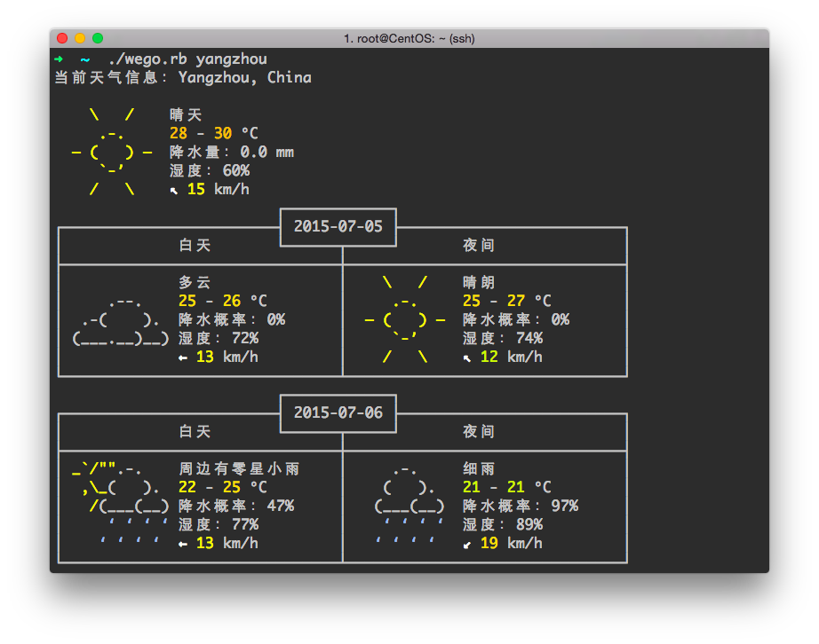

# wego.rb

wego.rb 是用 Ruby 编写的终端天气查询应用，天气数据由 [World Weather Online](http://www.worldweatheronline.com) 提供。

基于 Go 语言项目 [schachmat/wego](https://github.com/schachmat/wego) 改写，遵循其 [LICENSE](./LICENSE)。

## 用法

* `ruby wego.rb [城市] [查询天数]`
* 城市名请使用英文，亦可使用国名（返回首都天气）和 IP。若名称中需要包含空格，请加上引号。
* 未指定城市则使用当前 IP 查询。
* 查询天数范围为 0 - 5，默认值为 2。

## 运行环境

* Ruby >= 2.0
* 支持 UTF-8 的 256 色终端

